# Задание
https://github.com/netology-code/ter-homeworks/blob/main/05/hw-05.md


# Задание 1
Возьмите код:
из ДЗ к лекции 4,
из демо к лекции 4.
Проверьте код с помощью tflint и checkov. Вам не нужно инициализировать этот проект.
Перечислите, какие типы ошибок обнаружены в проекте (без дублей).


## скопируем  ДЗ к лекции 4 

Проверим  код с помощью tflint и checkov

```
cd demonstration1/
```
```
 docker run --rm -v "$(pwd):/tflint" -w /tflint ghcr.io/terraform-linters/tflint
```

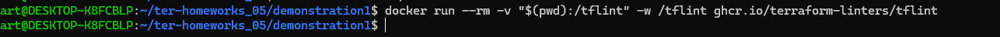


```
docker run --rm --tty --volume $(pwd):/tf --workdir /tf bridgecrew/checkov --download-external-modules true --directory /tf

```

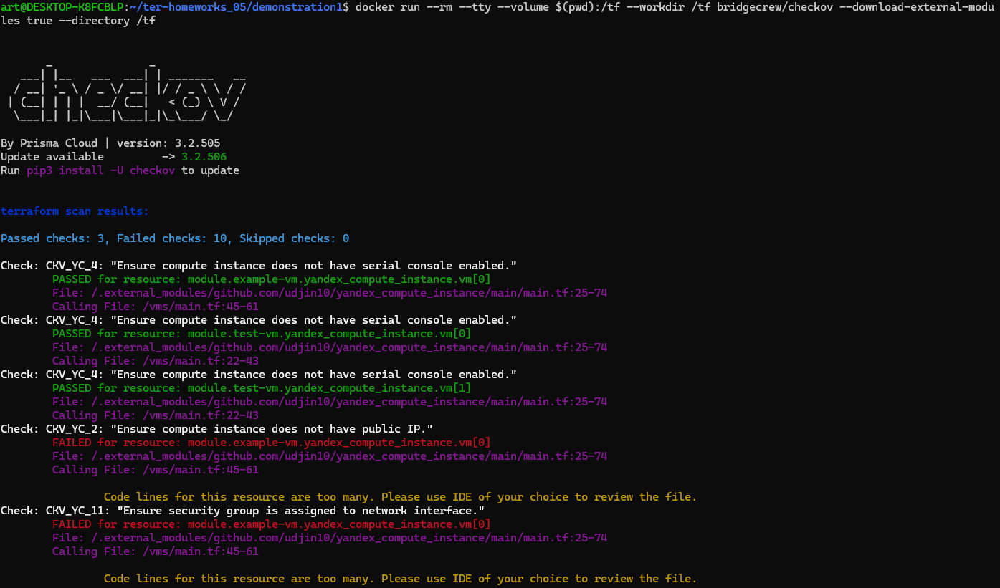

Тут куча коментариев


теперь проверим ```src```

```
cd src/
```
```
docker run --rm -v "$(pwd):/tflint" -w /tflint ghcr.io/terraform-linters/tflint
```
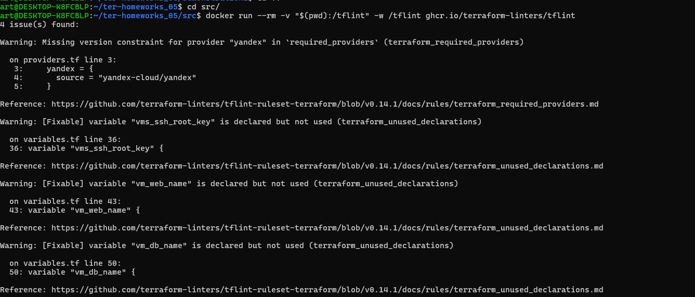

```
 docker run --rm --tty --volume $(pwd):/tf --workdir /tf bridgecrew/checkov --download-external-modules true --directory /tf
```


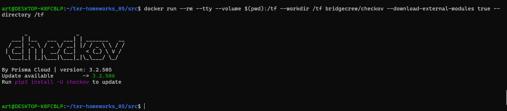

а тут нет ни чего


# Задание 2


1. Возьмите ваш GitHub-репозиторий с **выполненным ДЗ 4** в ветке 'terraform-04' и сделайте из него ветку 'terraform-05'.
2. Настройте remote state с встроенными блокировками:
   - Создайте S3 bucket в Yandex Cloud для хранения state (если еще не создан)
   - Создайте service account с правами на чтение/запись в bucket
   - Настройте backend в providers.tf с использованием нового механизма блокировок:
     ```hcl
     terraform {
       required_version = "~>1.12.0"
       
       backend "s3" {
         bucket  = "ваш-bucket-name"
         key     = "terraform.tfstate"
         region  = "ru-central1"
         
         # Встроенный механизм блокировок (Terraform >= 1.6)
         # Не требует отдельной базы данных!
         use_lockfile = true
         
         endpoints = {
           s3 = "https://storage.yandexcloud.net"
         }
         
         skip_region_validation      = true
         skip_credentials_validation = true
         skip_requesting_account_id  = true
         skip_s3_checksum            = true
       }
     }
     ```
   - Выполните `terraform init -migrate-state` для миграции state в S3
   - Предоставьте скриншоты процесса настройки и миграции
3. Закоммитьте в ветку 'terraform-05' все изменения.
4. Откройте в проекте terraform console, а в другом окне из этой же директории попробуйте запустить terraform apply.
5. Пришлите ответ об ошибке доступа к state (блокировка должна сработать автоматически).
6. Принудительно разблокируйте state командой `terraform force-unlock <LOCK_ID>`. Пришлите команду и вывод.

**Примечание:** В Terraform >= 1.6 появился встроенный механизм блокировок через `use_lockfile = true`. 
Это упрощает настройку - больше не нужно создавать отдельную базу данных (YDB в режиме DynamoDB) для хранения блокировок.
Lock-файл создается автоматически в том же S3 bucket рядом с state-файлом с именем `<key>.lock.info`.


# Создаем сервисный аккаунт
```
yc iam service-account create --name terraform --folder-id $(yc config get folder-id)
```

## Создадим ключ 
```
yc iam access-key create  --description " yc iam access-key create  --description "sting" --service-account-name terraform2 --format json > access-key.json" --service-account-name terraform2 --format json > access-key.json
```
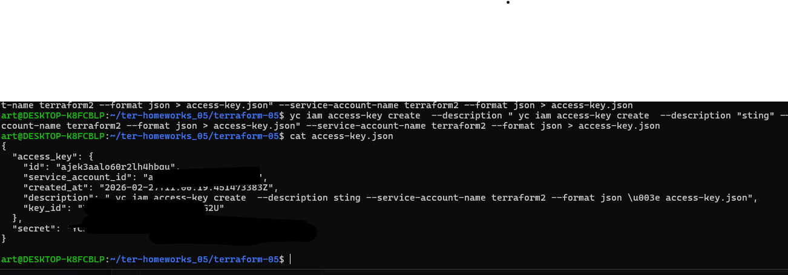

## Создадим конфиг

```
mkdir -p ~/.aws
cat > ~/.aws/credentials << EOF
[default]
aws_access_key_id =--------------------
aws_secret_access_key = ------------------------------
EOF
```
проверим 
```
 cat  ~/.aws/credentials

```


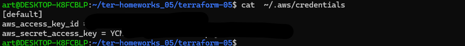


Инициализируем проект


```
 terraform init

```
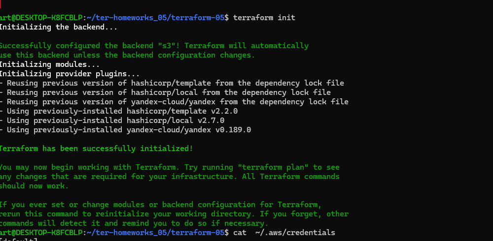
```
terraform apply

```
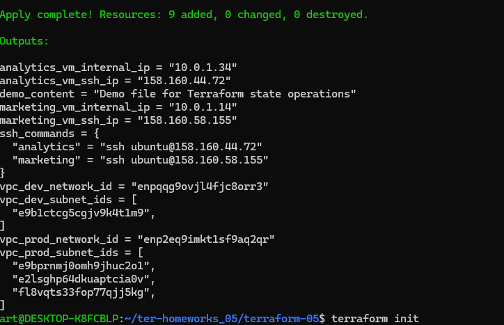
### проверим что локально появился ``terraform.tfstate``


в файл providers.tf добавим 
```
terraform {
  
  backend "s3" {
    bucket  = "test-bucket-netology-homework"  # замените на имя вашего бакета
    key     = "terraform.tfstate"
    region  = "ru-central1"
    
    # Встроенный механизм блокировок (Terraform >= 1.6)
    use_lockfile = true
    
    endpoints = {
      s3 = "https://storage.yandexcloud.net"
    }
    
    skip_region_validation      = true
    skip_credentials_validation = true
    skip_requesting_account_id  = true
    skip_s3_checksum            = true

    # Можно добавить явное указание профиля
    profile = "default"
  }
}
```
Инициализируем
```
 terraform init
```


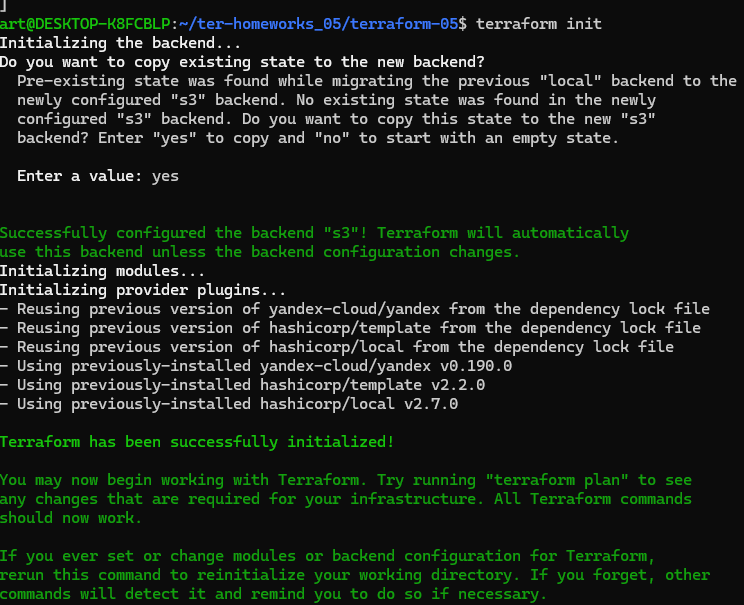
```
terraform apply

```
файл terraform.tfstate пустой  т.к. стайт перенессая в наш бакет
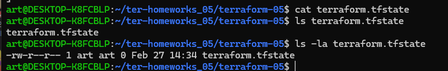


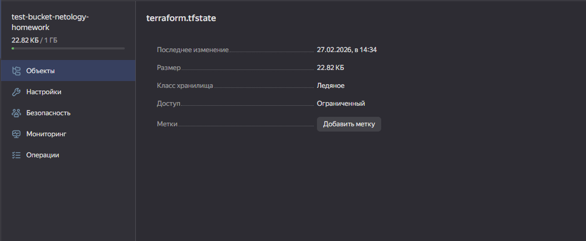


## Проверяем блокировку

В первом терминале открываем консоль:

```
terraform console
```
```
terraform apply -auto-approve
```


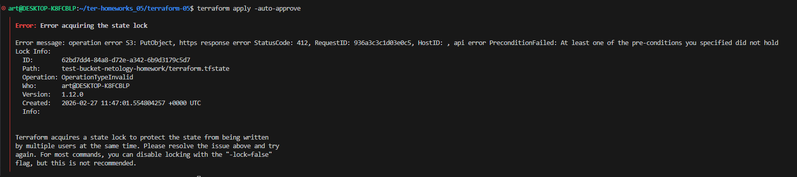


## Принудительная разблокировка


```
# Получаем LOCK_ID из предыдущей ошибки и разблокируем
terraform force-unlock 62bd7dd4-84a8-d72e-a342-6b9d3179c5d7
```
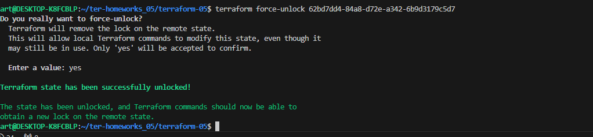
```
terraform apply -auto-approve

```
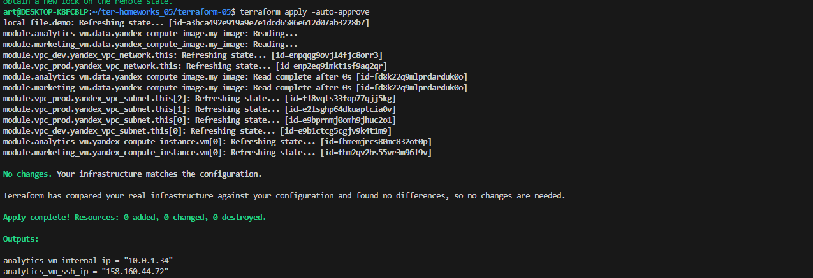


------
### Задание 3  

1. Сделайте в GitHub из ветки 'terraform-05' новую ветку 'terraform-hotfix'.
2. Проверье код с помощью tflint и checkov, исправьте все предупреждения и ошибки в 'terraform-hotfix', сделайте коммит.
3. Откройте новый pull request 'terraform-hotfix' --> 'terraform-05'. 
4. Вставьте в комментарий PR результат анализа tflint и checkov, план изменений инфраструктуры из вывода команды terraform plan.
5. Пришлите ссылку на PR для ревью. Вливать код в 'terraform-05' не нужно.

------
```
git checkout terraform-05
```
```
git checkout -b terraform-hotfix
```
# Проверяем текущую ветку
```
git branch
```
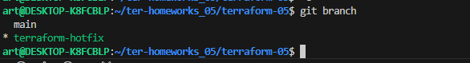

## сделаем проверку

```
docker run --rm --tty --volume $(pwd):/tf --workdir /tf bridgecrew/checkov --download-external-modules true --directory /tf
```

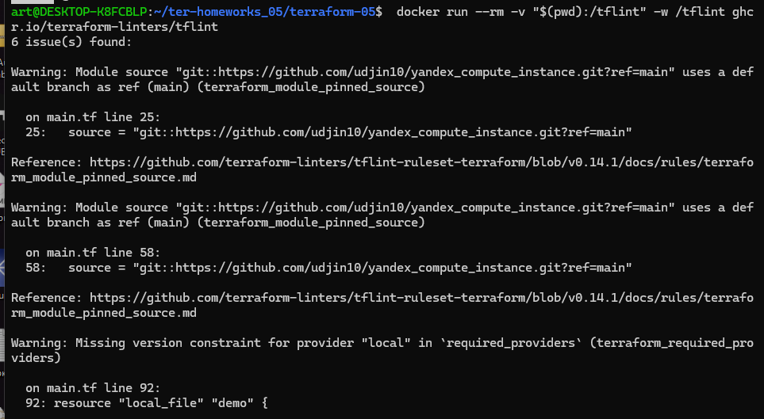

исправим ошибки
docker run --rm --tty --volume $(pwd):/tf --workdir /tf bridgecrew/checkov --download-external-modules true --directory /tf

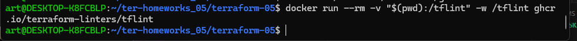

Если ошибок не то пустой вывод 


terraform-hotfix', сделаем коммит
```
 git checkout -b terraform-hotfix
```
```
git add .
git commit -m "add README-fix adnd screen"
```
Создадим PR


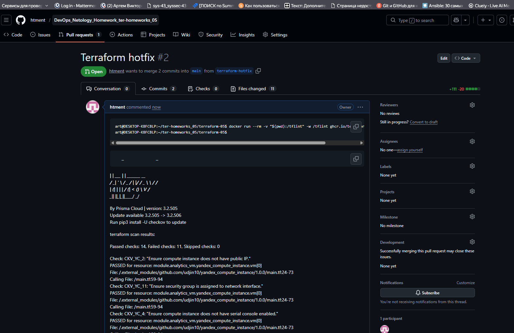


# Задание 4

1. Напишите переменные с валидацией и протестируйте их, заполнив default верными и неверными значениями. Предоставьте скриншоты проверок из terraform console. 

- type=string, description="ip-адрес" — проверка, что значение переменной содержит верный IP-адрес с помощью функций cidrhost() или regex(). Тесты:  "192.168.0.1" и "1920.1680.0.1";
- type=list(string), description="список ip-адресов" — проверка, что все адреса верны. Тесты:  ["192.168.0.1", "1.1.1.1", "127.0.0.1"] и ["192.168.0.1", "1.1.1.1", "1270.0.0.1"].


## Создадим variables.tf


```
# Переменная для одного IP-адреса
variable "ip_address" {
  type        = string
  description = "IP-адрес"

  validation {
    condition = can(regex("^(25[0-5]|2[0-4][0-9]|[01]?[0-9][0-9]?)\\.(25[0-5]|2[0-4][0-9]|[01]?[0-9][0-9]?)\\.(25[0-5]|2[0-4][0-9]|[01]?[0-9][0-9]?)\\.(25[0-5]|2[0-4][0-9]|[01]?[0-9][0-9]?)$", var.ip_address))
    error_message = "Значение должно быть корректным IPv4-адресом."
  }
}

# Альтернативный вариант валидации с использованием cidrhost()
variable "ip_address_cidr" {
  type        = string
  description = "IP-адрес (проверка через cidrhost)"

  validation {
    # Пробуем использовать IP как хост в сети /32
    condition = can(cidrhost("${var.ip_address_cidr}/32", 0))
    error_message = "Значение должно быть корректным IPv4-адресом."
  }
}

# Переменная для списка IP-адресов
variable "ip_addresses" {
  type        = list(string)
  description = "Список IP-адресов"

  validation {
    condition = alltrue([
      for ip in var.ip_addresses : can(regex("^(25[0-5]|2[0-4][0-9]|[01]?[0-9][0-9]?)\\.(25[0-5]|2[0-4][0-9]|[01]?[0-9][0-9]?)\\.(25[0-5]|2[0-4][0-9]|[01]?[0-9][0-9]?)\\.(25[0-5]|2[0-4][0-9]|[01]?[0-9][0-9]?)$", ip))
    ])
    error_message = "Все элементы списка должны быть корректными IPv4-адресами."
  }
}

# Альтернативный вариант для списка с использованием cidrhost()
variable "ip_addresses_cidr" {
  type        = list(string)
  description = "Список IP-адресов (проверка через cidrhost)"

  validation {
    condition = alltrue([
      for ip in var.ip_addresses_cidr : can(cidrhost("${ip}/32", 0))
    ])
    error_message = "Все элементы списка должны быть корректными IPv4-адресами."
  }
}
```


##  terraform.tfvars
```

# Верные значения
ip_address      = "192.168.0.1"
ip_address_cidr = "192.168.0.1"
ip_addresses    = ["192.168.0.1", "1.1.1.1", "127.0.0.1"]
ip_addresses_cidr = ["192.168.0.1", "1.1.1.1", "127.0.0.1"]

# Раскомментируйте для тестирования неверных значений:
# ip_address      = "1920.1680.0.1"
# ip_address_cidr = "1920.1680.0.1"
# ip_addresses    = ["192.168.0.1", "1.1.1.1", "1270.0.0.1"]
# ip_addresses_cidr = ["192.168.0.1", "1.1.1.1", "1270.0.0.1"]
```
проверим в terraform console
```
terraform console
```
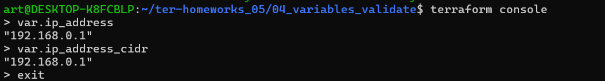


Раскомментируем неверные значения 

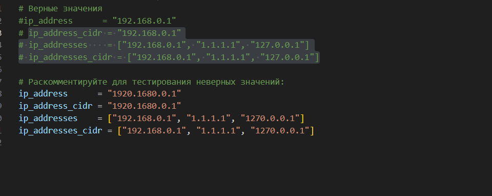

получаем сообщение об ошибке

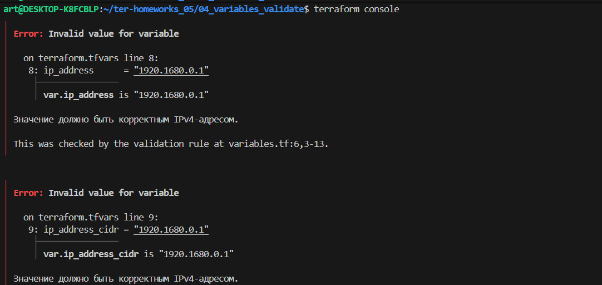


# Задание 5 

1. Напишите переменные с валидацией:
- type=string, description="любая строка" — проверка, что строка не содержит символов верхнего регистра;
- type=object — проверка, что одно из значений равно true, а второе false, т. е. не допускается false false и true true:
```
variable "in_the_end_there_can_be_only_one" {
    description="Who is better Connor or Duncan?"
    type = object({
        Dunkan = optional(bool)
        Connor = optional(bool)
    })

    default = {
        Dunkan = true
        Connor = false
    }

    validation {
        error_message = "There can be only one MacLeod"
        condition = <проверка>
    }
}
```
## terraform.tfvars

```
simple_string="Привет как дела"
#simple_string="привет как дела"
```

# variables.tf

```
variable "simple_string" {
  default = "ПЕРЕМЕННАЯ НЕ ЗАДАНА!!!"
  type        = string
  description = "любая строка"

  # ВАЛИДАЦИЯ: проверяем, что нет заглавных букв
  validation {
    # Условие: строка равна самой себе в нижнем регистре
    # Если есть хоть одна заглавная буква -> условие ЛОЖЬ -> ошибка
    condition = var.simple_string == lower(var.simple_string)
    
    # Сообщение, которое увидит пользователь при ошибке
    error_message = "ОШИБКА: в строке есть заглавные буквы! Используйте только маленькие буквы."
  }
}
```
Проверяем
```
terraform console
```
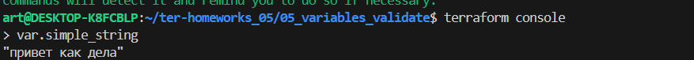

меяем 
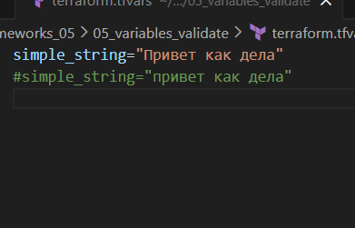

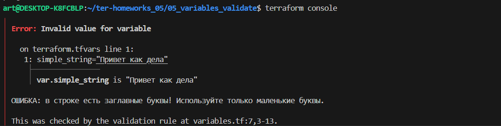

```
# ПЕРЕМЕННАЯ 2: выбор между Коннором и Дунканом
variable "who_is_better" {
  description = "Кто круче: Коннор или Дункан?"
  
  type = object({
    Dunkan = optional(bool)
    Connor = optional(bool)
  })

  # Значение по умолчанию
  default = {
    Dunkan = true
    Connor = false
  }

  validation {
    # Проверяем, что значения РАЗНЫЕ (один true, другой false)
    condition = var.who_is_better.Dunkan != var.who_is_better.Connor
    error_message = "ОШИБКА: должен быть только один МакЛауд! (true/false или false/true)"
  }
}
```
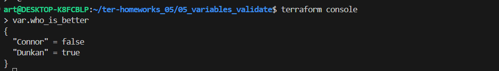
